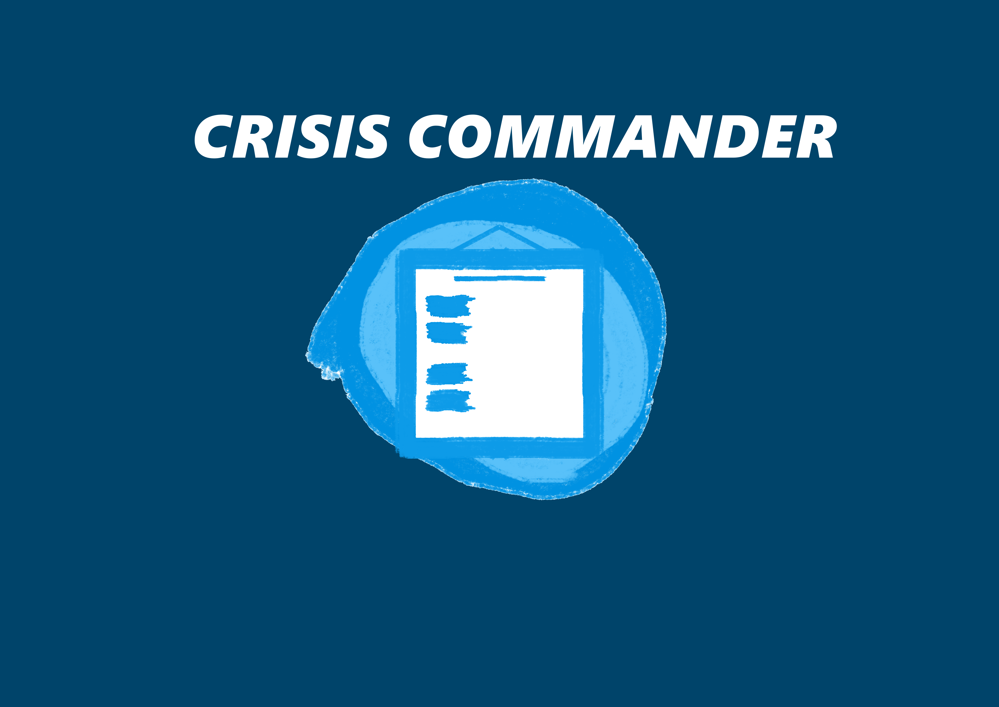

# Why Did We Make This
This was made for PlutoHacks 2024. The theme was Emergency Preparedness,
with our project focusing on giving administrators in a hospital
the ability to make Emergency Response Plans (ERP) for patients and
faculty. Administrators would make ERPs in case of emergencies such as
hurricanes or even bomb threats. The ERPs would be different for patients 
and faculty. Patients would be able to see a list of steps to follow to
get to safety with the option of giving feedback if they were incapable of
following certain steps. Faculty would have a list of steps to follow to assist asigned high-priority 
patients that require their help to get to safety using feedback passed from the administrators to prioritize
certain patients. Faculty members would also have the ability of giving feedback in case they are unable to help certain patients,
allowing for the administrators to reallocate the patients to another faculty member.

# Front End Documentation
npm install

# Back End Documentation

go get github.com/google/uuid

cd backend

go run .

# Presentation 

https://uflorida-my.sharepoint.com/:p:/g/personal/nicholas_cuc_ufl_edu/EZaMLRNLOwhEn9n51aOYnAUBPT5MI8IfgmDx9CSAJo1cXw?e=0rbC1v

# Link To Main Repository Used During Hackathon
https://github.com/RayhanM17/crisis-commander.git
